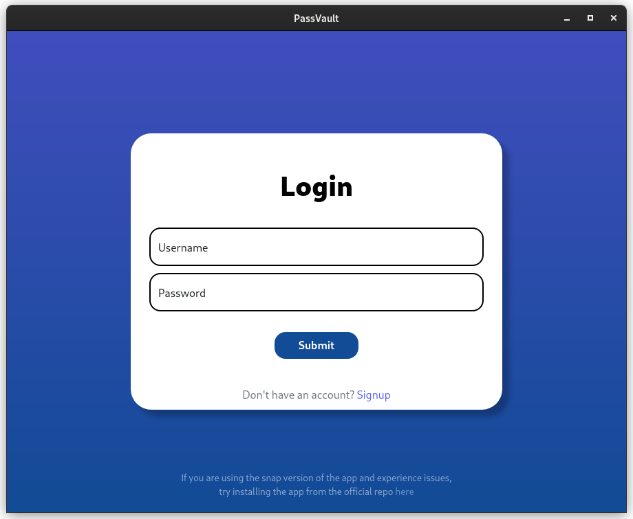
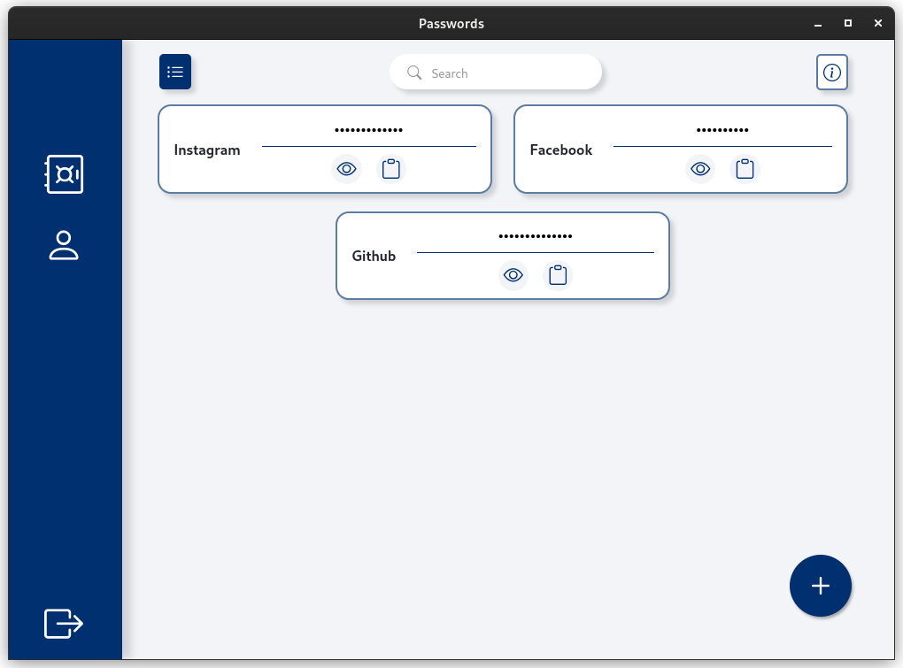
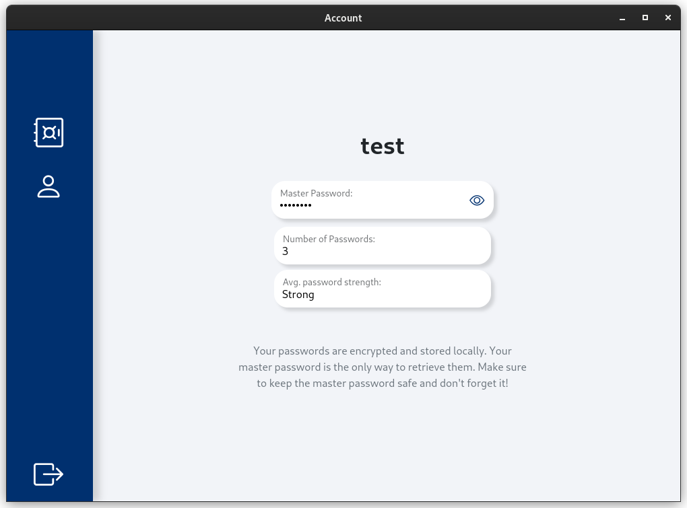

# PassVault
  

&nbsp;

### Update
I've decided to put this project to sleep. What started as a hobby beginner project has reached a stage where I feel comfortable to wrap up. There are certainly many things to improve on this application, but for now PassVault shall be what it is, a simple straightforward password manager.

## Info
Electron based cross-platform desktop application for managing passwords

Store and manage your passwords on your local machine. This desktop application solves the problem of forgotten passwords and helps with your heedless behaviour of same-password-for-all-sites.  

With the help of this application you can confidently set unique and complex passwords and hand over the burden of remembering them to PassVault, you just have to remember a global-password. The passwords are encrypted and stored in your machine, making it super safe.

      
      
      

## Features
* Supports multiple users  
* Password strength indicator
* Copy passwords to clipboard  
* Search for passwords
* Update password
* View average password strength
* Notifications

##  Contribute

PassVault is open-source. If you'd like to help out by adding features, working on bug fixes,
or assisting in other parts of development, here's how to get started:

###### To begin working locally:
All pull requests must be directed to the feature-updates branch.
1. [Fork](https://help.github.com/articles/fork-a-repo/) this repository to your
   own GitHub account
2. [Clone](https://help.github.com/articles/cloning-a-repository/) it to your
   local device
3. cd into the repo
4. Install the dependencies: `npm install`
5. Run the app by starting electron, building the code and watch for changes:
   `npm start`
